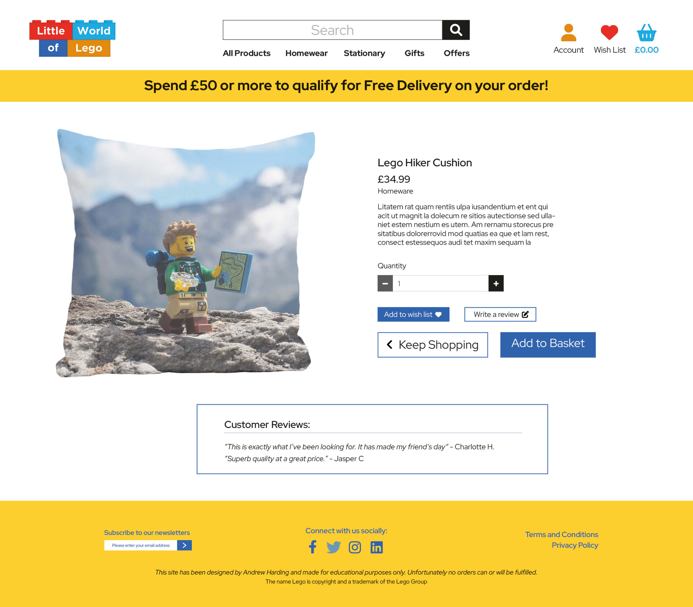
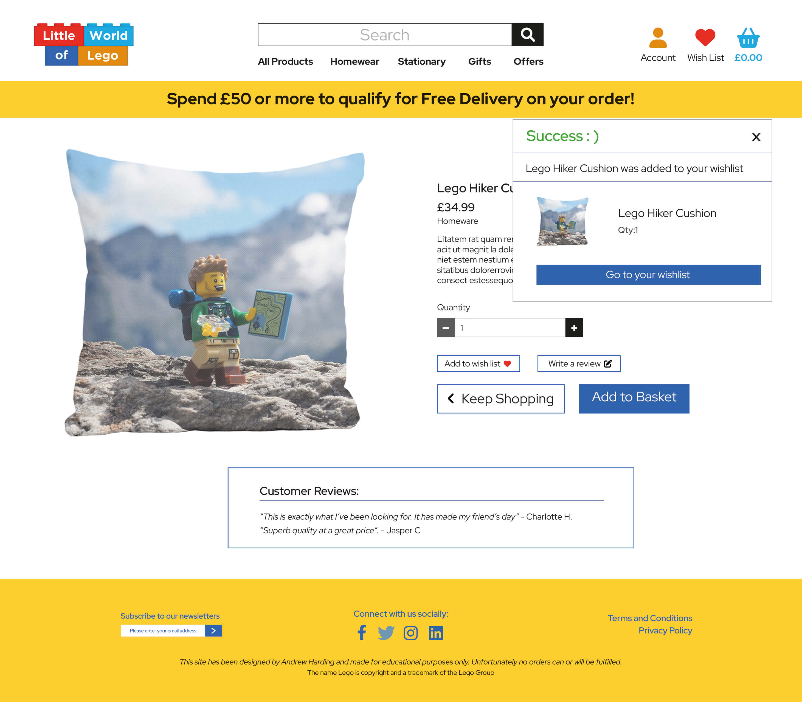
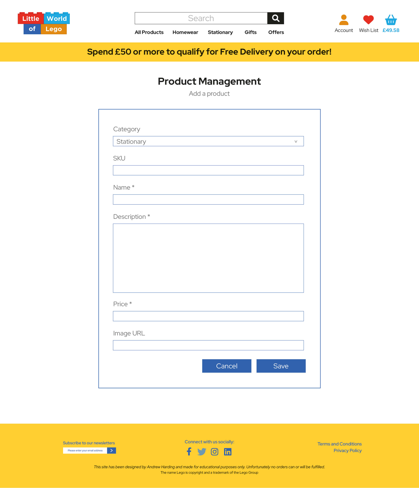

# Little World of Lego

This is an eCommerce store that I have designed based on products that show Lego Minifigures in different settings/environments. I decided to use the Minifigures from Lego as they are the main part of the many sets that Lego release. This is shown in the many Minifigure releases by lego such as the yearly releases, Marvel, DC, Looney Tunes, Simpsons, Batman, The Lego Movie, Harry Potter, Fantastic Beasts to name a few. I liked the way that these Minifigures could be used to show every day life, or things that we can instantly recognise and thus extending the fun, creativity and playfulness that can be demonstrated further of which these Minifigures already bring to so many people of all ages. 

### Disclaimer
My eCommerce site has been built for educational purposes and as great as the products and prices are, unfortunately no orders, deliveries etc can or will be able to be fulfilled. I understand that reading through my README files I have written about providing great service, products etc, but this has been written as if this were a real functioning fully operational business that is able to supply the products that are listed for sale.

## Showcase:

A deployed live version of my Little World of Lego eCommerce site can be found [here](URL HERE)
This domain link will allow you to access and explore my Little World of Lego eCommerce store. My eCommerce store has been designed to be fully responsive across all devices and layouts, whilst also being simple, clean and easy to use. This makes up my fourth and final Milestone project as part of the Code Institute Full Stack Web Developer Course. 

## Table of Contents
1. [User Experience UX](#user-experience-ux)
    * [User Stories](#user-stories)
    * [Admin Only](#admin-only)
    * [Site Goals](#site-goals)
2. [Construction Planes](#construction-planes)
    * [Strategy](#strategy)
    * [Scope](#scope)
    * [Structure](#structure)
    * [Skeleton](#skeleton)
    * [Surface](#surface)
3. [Design](#design)
    * [Imagery](#imagery)
    * [Wireframes](#wireframes)
4. [Features](#features)
    * [Future-features](#future-features)
    * [Operational Future Features](#operational-future-features)
5. [Technologies and Languages Used](#technologies)
    * [Libraries Frameworks and Online Resources Used](#libraries)
    * [Tools](#tools)
    * [Programmes](#programmes)
    * [Other Resources](#other-resources)
    * [Social Media](#social-media)
6. [Testing](#testing)
7. [Bugs](#bugs)
    * [Bugs Fixed](#bugs-fixed)
    * [Known Bugs](#known-bugs)
8. [Deployment](#deployment)
9. [Credits](#credits)
    * [Content](#content)
    * [Media](#media)
    * [Acknowledgments](#acknowledgments)

## User Experience UX:
My eCommerce store home page showcases a small selection of the products and the categories that these relate to. This has been done with the user in mind and so that the user not only instantly gets a feel for the products that we have to offer them, but can also see in the text provided the different items that are on sale for them to purchase. Clicking the Shop Now button (for example in the Homewear section) on the home page will take the user to the All Homewear page. Here users will be able to see the cushions, canvasses and framed prints that feature in this category. I have reinforced this by using the nav bar to show the product category names. Here users can click to see the sub categories and then navigate through them from here. 

Once a user arrives at the product page they are able to browse the products that are listed for sale, a photo of the product and their prices are shown to them. When a user clicks into the product they are able to see descriptions, a photo of the item and its price. Items are all separated into categories making it easier for the user to find certain items. To help the user further they also have the ability to use the search function to find products if the user requires this. 

Users are able to add items to their basket, update the quantities in their basket, or even remove items from their basket altogether whilst being able to see the grand total and delivery price reflect the new amount or product price as they do so.

Users are able to register for an account and will be asked to verify their email address. Once their email address has been verified this creates the user a profile. When the user is logged in they are able to see their order history and easily check out as their details are saved from previous successful purchases. 

There is are a couple of exceptions to this rule. The first exception is that the name field is not automatically filled, this is a good thing as someone may like to change their name being it first, last or both, or like I have previously done have the item delivered to the same address, but for someone else that also lives with me.  Another exception to this rule is the card that was used for purchase(s) field will not be automatically filled with previous information. This has a couple of good reasons that I can think of and these are: 
* the card may have expired and so the user needs to input the new details.
* security purposes in the event of an attack on the site and entry to the database being obtained.
Whilst I also understand that this can be a bit annoying for users, but it is probably in their best interests that this is left the way that it currently is.

Upon completion of a user’s purchase they are notified that an email confirmation has been sent to their email address. This lists the order number, order date, products ordered, order total, delivery total, grand total, shipping address and phone number. This also lets the user know that if they have any questions they can get in touch with us via email. Also included are the different social media icons that link to my social media pages/groups for users to interact with, as well as an extra line to help the user reach out to us in the event of a problem occurring or if they require extra help with their order. 

I hope that with the user in mind that they find the shopping experience a pleasant, easy and rewarding experience and will continue to come back to make further purchases with us.

## User Experience:

#### User Stories:
* Browse the site and get a good understanding of what this has to offer me as a user/customer.
* Navigate from home page to specific product categories using the Shop Now buttons or the nav bar with the drop down links.
* See product images and prices, then click into products to see images, descriptions and price clearly laid out.
* Find items using links provided.
* Sort products by price lowest to highest and highest to lowest.
* Sort products by name A-Z or Z-A. 
* Sort products by category A-Z or Z-A. 
* Search for items.
* Add products to my basket ready for checkout.
* See the total price displayed under the basket icon as well as a notification that if I spend x amount more I can get free next day delivery.
* See the cost of items in my basket excluding the delivery costs.
* Go into my basket and update the quantity of the product(s) that I have added or even remove products from my basket.
* Upon updating products or removing products see the price change for product subtotal, delivery charge and also grand total updated.
* If I am a new user be able to register for an account and validate my email address to gain access to my new created account.
* If I am an existing user be able to log into my account so that I can complete my purchase.
* Before completing my order and entering in my card details see the products and quantities of products in my basket and how much I will be charged before I enter my card details.
* Complete my purchase by being able to enter my delivery details and credit card number.
* Be aware that the payment is processing through an icon or something showing on screen to indicate this.
* Once I have checked out and completed my order be sent an email confirmation so that I have something to refer to should there be any issues.
* See my order history when I am logged in and go to my profile. This is so that I have something to refer to should I not receive the email confirmation, have accidentally deleted the email, or can’t find the email that was sent upon order completion.
* Be able to log into my account, and if I forget my password be able to easily reset this so that I can access my account again.
* Update my details such as name, address, email and phone number in my profile.
* Add and remove items to and from my wish list.
* Add items to my basket from my wish list.
* Leave a review for items purchased.

#### Admin Only
* Update product descriptions for items that I have for sale.
* Add new products so that I can extend the range that the store has to offer my customers.
* Delete products that are no longer in stock.

#### Site Goals:
* Provide my users with a variety of Lego related items that they will want to purchase and be pleased with.
* Provide great quality throughout, not only with products and descriptions but with user experience and site navigation/layout and ease of use.
* Provide my users with a way to add items to a wish list so that these can be added to their basket and purchased later. This will help the user in being able to easily find the items they like, as well as save them time. This adds to a good user experience and shows the user one of the ways that we are focused on their needs.
* Allow users to share reviews of the products purchased. This allows other users to be able to make a clear and informed choice based on other customer’s feedback.

## Construction Planes:
#### Strategy:
The original name for my site was going to be Lego Worlds, or even Lego Life as the products all show Lego Minifigures in the natural world. When I Googled to make sure I wasn’t using names or trademarks that had already been taken. As Lego owns both Lego Worlds and Lego Life I decided I would change the name to Little World of Lego. On my home page that the user instantly lands on shows some of the different products that are available to be purchased, as well as lists the others in that category. This helps the user gain an understanding of what is in store for them to be able to purchase and what this site is about.

#### Scope:
The features and main parts that are on the table for production are:
* Home page
* Product Page
* Product Search
* Product Viewed page
* Basket page
* Sign in page
* Register page
* Checkout page
* Checkout complete page
* My profile
* Product Management page - Admin Only
* Error page

The bits that I will be adding that are on the table for production are:
* Wish list
* Reviews
These extra features will help users save time (using their wish list to later add items to their basket and then check out) as well as be able to engage with the site by leaving a review about the product(s) they have purchased.

The bits that are the nice to haves, but that are not going to be produced for now are:
* Social Media Login
* Blog
* Subscribe to our emails
This doesn’t mean that I won’t include these at a later date, but given the production time, bug fixes, testing and other processes to go through it may not be achievable in the time frame.

I hope that with the information provided on the home page as mentioned in the strategy plane, that this gives the users a clear understanding of what this eCommerce site has to offer them. With the site cleanly laid out and the navigation there for users to be able to use I would hope that this reinforces the above too.

#### Structure:
The structure of my site allows users to quickly navigate from the home page to their chosen product category using the Shop Now buttons provided. The icons in the nav bar allow users quick access to their profile, wish list  and basket. With the profile and wish list users are asked either to register for an account or sign in if there are not already signed in or registered. This means that the user will know that their wish list is saved to their account and not wonder why they are seeing a blank wish list and any confusion caused by this. Accessibility will be included throughout the site for people with screen readers. I will include a back to top function to give users further help and functionality that they are able to use, again showing that they were at the forefront of the design process.

#### Skeleton:
All of the products contained within this site will be grouped into categories and have the relevant headings so that the user knows what page they are on. All product categories will accessible by the navigation bar at the top and will be easy to locate as they will have their sub categories shown when the dropdown is selected. The user will also be able to locate all items in that category by being able to select the All Products in the menu too. This will show them everything that is in the category should they wish to shop by all items in the category, instead of by each individual sub category. As mentioned before the user will also be able to locate all items in the categories by clicking the individual Shop Now links on the home page. Across all pages the Nav bar will feature to help users, but also in the categories will be small buttons at the top allowing users to quickly access other items from the category that they are in. Also the user will be able to search from any page they are on using the search function located in the main nav bar. In the footer which will also show on all pages will be the links for Social Media that link to the various pages/groups that I have set up. There are various Font Awesome icons that have been used to help make this easier to find and more interesting/friendlier to the user.

#### Surface:
The finished site will keep the clean, structured and efficiently organised layout to allow users to find what they are looking for. This also ensures that information is presented clearly to the user, the user has a good experience and is able to navigate easily round my site.
I have chosen a front from [Google fonts](https://fonts.google.com/specimen/Red+Hat+Display?query=red+) called Red Hat Display. This is a clean font that has been used throughout my site and helps ensure that users are able to read this, as well as give the site a professional look. I have used the Lego yellow colour as well as adding in red, blue, light blue (for the social media hovered icons), teal, burnt orange and using the standard black. The red, teal, blue and burnt orange are the colours that I used on the bricks in the logo. I like the blue on the yellow in the footer, as well as the main site as they compliment each other and stand out.

## Design:
With this site having many pages that you would expect I have kept the designs simple, clean and easy to follow, whilst also being colourful and complementary. My home page showcases some of the products that are available to purchase in the different categories, my aim of showing these products is to present to the user a preview of what we have to offer.  

The original mock designs that I produced in [Adobe InDesign](https://www.adobe.com/uk/products/indesign.html) can be found below:

#### Home / Index page

#### Homewear page

#### Stationary page

#### Gifts page

#### Offers page

#### Product Search results page

#### Product viewed page

#### Product viewed page Admin only view

#### Product added to basket page 1

#### Product added to basket page 2

#### My basket page 1

#### My basket page 2

#### Sign in account page

#### Register for an account page

#### Checkout page

#### Checkout processing page

#### Checkout complete page 1

#### Checkout complete page 2

#### My Profile page

#### Wish List Button Hover 1

#### Wish List Button Hover 2

 
#### Product added to Wish List

#### My Wish List

#### My Wish List Remove button clicked

#### My Wish List Item Removed

#### My Wish List multiple products showcase

#### Wish List Sign In

#### Product Management ADMIN page

#### My Design Help

#### Other Help

#### Error Pages

## Imagery:
I was originally going to use some of my own many Lego Minifigures that I have to use for the images, but didn’t have the time to edit the photos that I’d already taken, and with others still to find a location and shoot. This meant that I had to opt with sourcing and purchasing from [Adobe Stock](https://stock.adobe.com/uk/). Sourcing and downloading free images from [Pixabay](https://pixabay.com/) and [PXHere](https://pxhere.com/). I have broken down page by page where the images are used, apart from the All Products page where all the images are shown for all products. With these images I have been able to use Adobe InDesign, Adobe Photoshop and Illustrator to enable me to make all the products that you see on the products pages. Using the various images to put them together in the different Design Software Packages has allowed me to showcase a part of my Graphic Design skills in image manipulation. Having this skill has enabled me to make these appear as the final products that you see in the different categories. I was limited by images to use as there were not many that kept in with the Lego Minifigure only rule on a real background that I could use, and so some are repeated across many products. I was able to find different images that were added to the cards as these were the last items to be Designed and completed.

##### Favicon:
[Alphabet letters from colorful plastic toy blocks isolated to solid background](https://stock.adobe.com/uk/Library/urn:aaid:sc:EU:d9f0dfe8-b7b1-4b60-a004-4812543af956?asset_id=378503200)
By Anton
File #: 378503200

##### Home Page:
[Dark side bike ride](https://pixabay.com/photos/lego-star-wars-toy-darth-vader-6599840/)
By BioSteak
File #: 6599840

### Bricks used in the logo
[Set of building bricks in red color](https://stock.adobe.com/uk/images/set-of-building-bricks-in-red-color/422371679?asset_id=422371679)
By giadophoto
File #: 422371679

##### Homewear Products Page:
### Canvasses
[Canvas for painting, close-up](https://stock.adobe.com/uk/images/canvas-for-painting-close-up/295267084)
By Allusioni
File #: 295267084

[Beach Girl and dog](https://pixabay.com/photos/lego-minifigures-minifigure-sea-5974050/)
By CudrigoSteineSpaß
File #: 5974050

[Cleaner scouts](https://pixabay.com/photos/lego-miniatures-figurines-toys-5693138/)
By firdaus_ansori
File #: 5693138

[Beach Diver](https://pixabay.com/photos/lego-diving-sea-diver-toy-5597550/)
By thuanvo
File #: 5693138

[Bride and Groom](https://pxhere.com/en/photo/1347065)
File #: 1347065

[Minecraft](https://pixabay.com/photos/toy-lego-plastic-toy-children-5518501/)
By thuanvo
File #: 5518501

[Ski Lady](https://pixabay.com/photos/lego-ceramic-art-4188659/)
By Jaejene
File #: 4188659

[Pest Police](https://pixabay.com/photos/slug-policeman-lego-garden-pest-1535140/)
By aitoff
File #: 1535140

[Troopers holding hands](https://pixabay.com/photos/romance-relationship-love-lego-2004799/)
By aitoff
File #: 2004799

[Witches](https://pixabay.com/photos/lego-campfire-forest-wood-flame-1506521/)
By Superbelfrzy
File #: 1506521

### Cushions
[cushion on a white background](https://stock.adobe.com/uk/images/cushion-on-a-white-background/137455749)
By bennnn
File #: 137455749

[Bohemian Stormtroopers](https://pixabay.com/photos/stormtrooper-bohemian-rhapsody-1433772/)
By aitoff
File #: 1433772

[Desert Troopers](https://pixabay.com/photos/storm-troops-starwars-lego-4584285/)
By 501stCommanderMax
File #: 4584285

[Elf](https://pixabay.com/photos/lego-lego-christmas-elf-6764357/)
By BCStirke
File #: 6764357

[Hiker](https://pixabay.com/photos/lego-mini-figure-walker-6571821/)
By Ralf1403
File #: 6571821

[Gandalph](https://pxhere.com/en/photo/1193558)
File #: 1193558

[Fun Guy](https://pixabay.com/photos/nature-outdoors-small-lego-3091155/)
By nxmsophia
File #: 3091155

[Sand Biker](https://pixabay.com/photos/motorcycle-dirt-bike-off-road-lego-1975858/)
By mvarouhas
File #: 1975858

[Sand surfer](https://pixabay.com/photos/lego-surfer-sand-macro-6607553/)
By BioSteak
File #: 6607553

[Santa](https://pixabay.com/photos/lego-lego-santa-christmas-6764356/)
By BCStirke
File #: 6764356

[Black and white water with colour Diver](https://pixabay.com/photos/lego-water-splash-blow-immersion-352113/)
By ejaugsburg
File #: 352113

### Framed Photos
[blank black horizontal picture frame on the white concrete wall](https://stock.adobe.com/uk/images/blank-black-horizontal-picture-frame-on-the-white-concrete-wall/69991288)
By mtlapcevic
File #: 69991288

[Beach Biker](https://pixabay.com/photos/lego-bike-toy-lego-toy-lego-bike-5597548/)
File #: 5597548

[Bohemian Stormtroopers](https://pixabay.com/photos/stormtrooper-bohemian-rhapsody-1433772/)
By aitoff
File #: 1433772

[Clone Trooper Drive Fix](https://pixabay.com/photos/toy-lego-technology-device-931951/)
By tookapic
File #: 931951

[Ctrl](https://pxhere.com/en/photo/914354)
File #: 914354

[Construction Workers](https://pixabay.com/photos/constructions-building-work-lego-3572863/) 
By yshoshan
File #: 3572863

[Flower man](https://pixabay.com/photos/lego-daisy-toy-figure-flower-6539234/0
By albarus
File #: 6539234

[Fun Guy](https://pixabay.com/photos/nature-outdoors-small-lego-3091155/)
By nxmsophia
File #: 3091155

[Ninjago](https://pxhere.com/en/photo/741576)
File #: 741576

[Love](https://pixabay.com/photos/lego-pair-love-valentine-s-day-4850732/)
By kueckhovener
File #: 4850732

[Fencing](https://pxhere.com/en/photo/281935)
File #: 281935

### Stationary Products Page:
### Desktop Calendar
White blank paper desk spiral calendar on white background.
https://stock.adobe.com/uk/images/white-blank-paper-desk-spiral-calendar-on-white-background/181879946
By resul
FILE #:  181879946

[Ctrl](https://pxhere.com/en/photo/914354)
File #: 914354

[Fisherman on lego pier](https://pixabay.com/photos/lego-lake-stream-park-fishing-6845890/)
By BCStirke
File #: 6845890

[Flower man](https://pixabay.com/photos/lego-daisy-toy-figure-flower-6539234/0
By albarus
File #: 6539234

[Hiker](https://pixabay.com/photos/lego-mini-figure-walker-6571821/)
By Ralf1403
File #: 6571821

[Sand surfer](https://pixabay.com/photos/lego-surfer-sand-macro-6607553/)
By BioSteak
File #: 6607553

### Wall Calendar
[2022 Calendar](https://stock.adobe.com/uk/templates/2022-calendar/461579195)
By Iunewind
File #: 461579195

[Fisherman on lego pier](https://pixabay.com/photos/lego-lake-stream-park-fishing-6845890/)
By BCStirke
File #: 6845890

[Hiker](https://pixabay.com/photos/lego-mini-figure-walker-6571821/)
By Ralf1403
File #: 6571821

[Ninjago](https://pxhere.com/en/photo/741576)
File #: 741576

[Starwars Arrest](https://pixabay.com/photos/starwars-kriegder-star-jedi-4793257/)
By 501stCommanderMax
File #: 4793257

### Notebooks
[White book mockup with a dried grass in a vase on the beige table](https://stock.adobe.com/uk/images/white-book-mockup-with-a-dried-grass-in-a-vase-on-the-beige-table/405793350)
By Snoflinga
File #: 405793350

[Biker](https://pixabay.com/photos/motorcycle-dirt-bike-off-road-lego-1975858/)
By mvarouhas
File #: 1975858

[Black and white water with colour Diver](https://pixabay.com/photos/lego-water-splash-blow-immersion-352113/)
By ejaugsburg
File #: 352113

[Droids](https://pixabay.com/photos/lego-snow-drift-star-wars-robot-2646527/)
By cherebus0
File #: 2646527

[Elf](https://pixabay.com/photos/lego-lego-christmas-elf-6764357/)
By BCStirke
File #: 6764357

[Fisherman on lego pier](https://pixabay.com/photos/lego-lake-stream-park-fishing-6845890/)
By BCStirke
File #: 6845890

[Hiker](https://pixabay.com/photos/lego-mini-figure-walker-6571821/)
By Ralf1403
File #: 6571821

[Rebel Trooper Starwars](https://pxhere.com/en/photo/641313)
File #: 641313

[Sand surfer](https://pixabay.com/photos/lego-surfer-sand-macro-6607553/)
By BioSteak
File #: 6607553

[Santa](https://pixabay.com/photos/lego-lego-santa-christmas-6764356/)
By BCStirke
File #: 6764356

[Storm Troopers amongst saplings](https://pixabay.com/photos/clone-war-grass-green-forest-4773016/)
By 501stCommanderMax
File #: 4773016

### Gifts Products Page:
### Fridge Magnets
[Flexible vinyl souvenir fridge magnet](https://stock.adobe.com/uk/images/flexible-vinyl-souvenir-fridge-magnet/480869428)
By Kuzmick
File #:  480869428

[Clone Trooper Drive Fix](https://pixabay.com/photos/toy-lego-technology-device-931951/)
By tookapic
File #: 931951

[Elf](https://pixabay.com/photos/lego-lego-christmas-elf-6764357/)
By BCStirke
File #: 6764357

[Fire fighters](https://pixabay.com/photos/outdoors-flower-wood-park-3377711/)
By kirkpatrickting
File #: 3377711

[Obi wan and Darth Maul](https://pixabay.com/photos/lego-star-wars-star-wars-lego-jedi-6750578/)
By matyasvargaphoto
File #: 6750578

[Painter Storm Trooper](https://pxhere.com/en/photo/1174464)
File #: 1174464

[Santa](https://pixabay.com/photos/lego-lego-santa-christmas-6764356/)
By BCStirke
File #: 6764356

[Segway Secret Agent](https://pxhere.com/en/photo/1288871)
File #: 1288871

[Sand surfer](https://pixabay.com/photos/lego-surfer-sand-macro-6607553/)
By BioSteak
File #: 6607553

[Troopers holding hands](https://pixabay.com/photos/romance-relationship-love-lego-2004799/)
By aitoff
File #: 2004799

[Dark side bike ride](https://pixabay.com/photos/lego-star-wars-toy-darth-vader-6599840/)
By BioSteak
File #: 6599840

### Cards 
[3d white blank paper card](https://stock.adobe.com/uk/images/3d-white-blank-paper-card/98956136)
By sveta
File #: 98956136

[Elf](https://pixabay.com/photos/lego-lego-christmas-elf-6764357/)
By BCStirke
File #: 6764357

[Santa](https://pixabay.com/photos/lego-lego-santa-christmas-6764356/)
By BCStirke
File #: 6764356

[Coffee Astronought](https://pixabay.com/photos/lego-coffee-wawerska-astronaut-5132610/)
By Diabiator
File #: 5132610

[Bride and Groom](https://pxhere.com/en/photo/1347065)
File #: 1347065

[Luke Skywalker Jedi Hut](https://pixabay.com/photos/starwars-lego-building-blocks-4584270/ )
By 501stCommanderMax
File #: 4584270

[Stunt Trooper](https://pixabay.com/photos/starwars-clone-motorcycle-lego-4584281/)
By 501stCommanderMax
File #: 4584281

[Christmas Scene](https://pixabay.com/photos/lego-coffee-shop-lego-7021506/)
By CudrigoSteineSpaß
File #: 7021506

[Skeleton Beach scene](https://pixabay.com/photos/lego-halloween-mini-figures-7006818/)
By CudrigoSteineSpaß
File #: 7006818

[Girl and dog on the beach](https://pixabay.com/photos/lego-toy-mini-figures-nature-water-7006819/)
By CudrigoSteineSpaß
File #: 7006819

[Storm Trooper on the beach](https://pixabay.com/photos/lego-stormtrooper-lego-beach-7021564/)
By CudrigoSteineSpaß
File #: 7021564

[Hiker](https://pixabay.com/photos/hiker-walker-rambler-lego-walk-1984421/)
By aitoff
File #: 1984421

[Troopers in the snow](https://pixabay.com/photos/lego-starwars-toy-snow-forest-6018655/)
By joergkessler1967
File #: 6018655

### Offers Products Page:
[Elf](https://pixabay.com/photos/lego-lego-christmas-elf-6764357/)
By BCStirke
File #: 6764357

[Santa](https://pixabay.com/photos/lego-lego-santa-christmas-6764356/)
By BCStirke
File #: 6764356

[Fisherman on lego pier](https://pixabay.com/photos/lego-lake-stream-park-fishing-6845890/)
By BCStirke
File #: 6845890

[Hiker](https://pixabay.com/photos/lego-mini-figure-walker-6571821/)
By Ralf1403
File #: 6571821

[Ninjago](https://pixabay.com/photos/still-life-toys-war-fight-battle-4687373/)
By muhammadriz
File #: 4687373

[Star Wars Arrest](https://pixabay.com/photos/starwars-kriegder-star-jedi-4793257/)
By 501stCommanderMax
File #: 4793257

[Ctrl](https://pxhere.com/en/photo/914354)
File #: 914354

[Flower man](https://pixabay.com/photos/lego-daisy-toy-figure-flower-6539234/0
By albarus
File #: 6539234

[Sand surfer](https://pixabay.com/photos/lego-surfer-sand-macro-6607553/)
By BioSteak
File #: 6607553

[Witches](https://pixabay.com/photos/lego-campfire-forest-wood-flame-1506521/)
File #: 1506521

### Error Page:
[Roman Soldier](https://pxhere.com/en/photo/653186)
File #: 653186

### No Image:
[Photo coming soon image icon. Vector illustration. Isolated on white background. No website photos yet logo sign symbol. Image not available yet.](https://stock.adobe.com/uk/images/photo-coming-soon-image-icon-vector-illustration-isolated-on-white-background-no-website-photos-yet-logo-sign-symbol-image-not-available-yet/308675145)
By ville
File #: 308675145

##### Font Awesome Icons:
* [Facebook icon](https://fontawesome.com/v5.15/icons/facebook-f?style=brands)
* [Twitter icon](https://fontawesome.com/v5.15/icons/twitter?style=brands)
* [Instagram icon](https://fontawesome.com/v5.15/icons/instagram?style=brands)
* [Linkedin icon](https://fontawesome.com/icons/linkedin?s=brands)
* [Home](https://fontawesome.com/icons/house?s=solid)
* [Search Site](https://fontawesome.com/v5.15/icons/search?style=solid)
* [Secure Checkout Lock](https://fontawesome.com/icons/lock?s=solid)
* [Blog](https://fontawesome.com/icons/pen-to-square?s=solid)
* [Keep Shopping](https://fontawesome.com/icons/angle-left?s=solid)
* [Email Sign Up](https://fontawesome.com/icons/chevron-right?s=solid)
* [Update Quantity Add](https://fontawesome.com/icons/plus?s=solid)
* [Update Quantity Remove](https://fontawesome.com/icons/minus?s=solid)
* [Payment Processing](https://fontawesome.com/icons/spinner?s=solid)
* [Back to top](https://fontawesome.com/icons/angle-up?s=solid)
* [Wishlist](https://fontawesome.com/icons/heart?s=solid)
* [Basket](https://fontawesome.com/icons/basket-shopping?s=solid)
* [Account](https://fontawesome.com/icons/user?s=solid)

## Wireframes:

#### Home / Index page

#### Products page

#### Product Search page

#### Product viewed page

#### Product added to basket page

#### My basket page

#### Sign in account page

#### Register for an account page

#### Checkout page

#### Checkout processing page

#### Checkout complete page

#### My Profile page

#### Product Management ADMIN page

# Features:
* The user is able to explore my site and products from the home page which is the first page they land on. They are able to click the Shop Now button that is in the same row as the heading, image and what the different categories are to take them to the All Products of the category button they have clicked. This will allow them to effortlessly browse what products are available in the category that has been selected. 
* The user is also able to access from the nav bar the categories that are listed on the home page, as well as extend into the sub categories using the dropdown menu.
* The user is able to access the login and registration dropdown by clicking on the Account icon in the Nav bar. If the user is logged in they are also able to access their profile.
* In the Nav bar the Wish list is featured. This allows a user quick access by clicking here, and signing in to see the items that they have placed in their wish list. If they are not logged in/registered will be directed to do so in order to view their wish list.
* Users are able to view their basket and total in the Nav bar under the basket icon. When a user wants to checkout they will be directed to register or login to complete their purchase.
* In the footer users are able to connect with our various social media channels, pages, groups etc by clicking on the different icons that are there.
* Users are able to easily navigate to the home page by either clicking on the logo in the top left hand corner of the nav bar in desktop view, or clicking on the collapsible menu bars and clicking the Home link.
* This site is fully responsible and works on different device sizes.

### Future features:
The future features that I would like to see on my site are:
* Something like a SALE or NEW IN sign that can be applied to items so that a user can see these clearly when looking in the All Offers category. This will help them spot the bargains to be had as well as show off our new items or items on sale to the user. This will show the user if they are a returning user that the site is being maintained.
* A coming soon page. This will allow users to see the exciting new products that this eCommerce store has to offer, and again that this is being updated and maintained regularly.
* Of course Lego isn’t Lego without actual Lego, and so I would like to add a category for the Minifigures themselves, then in sub categories have the different Minifigure themes, like Star Wars, City, Looney Tunes, Harry Potter, Disney, Simpsons, Marvel etc.
* I would like to with the above inclusion of Minifigures to be added at a later date to my site also add a blog. This will enable users to show off their Minifigures in different environments with creative photos that they have taken and shared. 

#### Operational Future Features:
The future features that I would like to add (should this site ever be made into a real fully operational business site that is able to accept payments for physical products) are:
* Order processing with updates so that a user can log in and see the status of their order(s). From order received through the stages of picking, dispatched (with the courier and tracking number) to delivered to the customer’s address. I would like to be able to link to external sites so that the user can see the full tracking history of their order. This is so they can see a clearer journey and get real time updates. Providing their phone number would allow the user to receive an update on the day of delivery too.
* A place where the user is able to respond to a chat feature and then be put in touch with a human at the end if required to help and assist them with any enquiries they may have.
* A way of letting a user know how many of a certain item are in stock in the Sale. This will help them to be able to make a purchase knowing that the items that they have put into their basket will be received and their order fulfilled.
* Out of stock shown on items that we have unfortunately sold out of.
* Notification email alert. A user can sign up to be notified when a specific item or items are back in stock so that they can make their purchase.
* A Rewards points scheme to reward purchases and keep buyers returning. Then allow the buyer to get money off their purchases by using their rewards points.
* Student Discount to encourage wider range of buyers to shop with us.
* Introduce a section so that users are able to purchase Gift Cards.
* More checkout payment options such as ApplePay, Google Pay, Amazon Pay or all of those methods mentioned here. 
* Two-Factor Authentication for added User security. A user can add this to secure their account to stop unauthorised access from hackers or anyone else attempting to gain access to the user’s profile/data.
* Add a field in the profile section that allows the user to change their email address if they would like to do so. This could be because they may have used first and last name and for any reason have changed one or both names.
* Add the ability to be able to add other addresses and set this as somewhere like work, friend or family. This will allow users who need their parcels delivered elsewhere to be able to get them delivered to whomever they would like to especially if they are buying gifts to be delivered directly, or even if they require their order being delivered to work.
* Add a field for Delivery Instructions. This will allow people that ask to leave deliveries in their porch, with a neighbour or a safe place to be able to communicate this. Having this feature would ensure that the customers parcel was delivered to the location of their choice, so they are able to receive this.
* Gift Wrap - If a customer was to order this for a friend, family member, work colleague etc having this would allow any price tags be removed, no paperwork and items to be wrapped ready for the lucky recipient to open.
* Email Newsletters to keep the buyers up to date of sales, new items etc and keep them returning to purchase from us.
* For items that may have more than one image I would like to include functionality to be able to show these images. This could be done by either clicking the image underneath the main image. This will replace the main image with the image clicked, or showcase these in a sort of carousel format.
* It would be great to have users interact with the site by adding something to their wish list and then sharing this on our social media channels. We could run a competition with a chance to win the item from their wish list.

## Technologies and Languages Used:
To build this fully functional cross platform responsive eCommerce store I have used the following Languages, Libraries Frameworks, online resources tools and programmes. Like my War Heroes Remembered Milestone 2 project and Talking Tinnitus Milestone 3 project again implemented the use of Social Media. This helps to give my site a more professional look and feel. When the Social Media icons are clicked the user is taken to a functioning page/group.

## Languages:
* [HTML5](https://en.wikipedia.org/wiki/HTML5) for the markup language to construct the site and content.
* [CSS3](https://en.wikipedia.org/wiki/Cascading_Style_Sheets) to help style the content on the pages, as well as help with the layout.
* [JavaScript](https://en.wikipedia.org/wiki/JavaScript) to help features to work as expected and add extra working features.
* [jQuery](https://jquery.com/) to help features to work as expected and add extra working features.
* [JSON](https://en.wikipedia.org/wiki/JSON) to complete the product categories and product descriptions documents.
* [Python](https://en.wikipedia.org/wiki/Python_(programming_language)) to run the site and command back end features.

## Libraries Frameworks and online resources:
* [Django](https://www.djangoproject.com/) providing the “batteries” to help with rapid development using the high level Python framework that is built in. 
* [Django Allauth](https://django-allauth.readthedocs.io/en/latest/installation.html): Prebuilt authentication system to help users and super users to register, log in and log out of the eCommerce store.
* [Bootstrap](https://getbootstrap.com/docs/4.6/getting-started/introduction/): For help with styling and layout of my eCommerce site.
* [Google Chrome Dev Tools](https://developer.chrome.com/docs/devtools/): For testing purposes and to see why elements are not working as expected. Dev tools allowed me to make changes to my code in the browser to see a live representation of my eCommerce site with the changes / amends that have been made.
* [Lighthouse](https://developers.google.com/web/tools/lighthouse): Was used for testing my website for Performance, Accessibility, Best Practices and Search Engine Optimisation (SEO). I have tested as before on my Go Tennis System the different categories mentioned above on both mobile applications and computer applications and have loaded the screenshots of the results in the testing section.
* [Google Fonts](https://fonts.google.com/): Google Fonts was used to find a suitable font as well as to import this font into my eCommerce site. The font that I decided to use as it was clean, stylish and fitting is called Red Hat Display which is displayed on all pages on my eCommerce throughout the project. This is to keep styles consistent throughout my eCommerce site.
[Amazon Web Services - AWS](https://aws.amazon.com/): Used to host my static CSS and JavaScript files as well as my media/image files. 
[Stripe](https://stripe.com/gb): Used for payments and checkout.
* [Font Awesome](https://fontawesome.com/): The Font Awesome Icons that I have used have been listed below:
* [Hamburger Bars icon](https://fontawesome.com/v5.15/icons/bars?style=solid)
* [Home button](https://fontawesome.com/icons/house?s=solid)
* [Search](https://fontawesome.com/icons/magnifying-glass?s=solid)
* [Secure Checkout](https://fontawesome.com/icons/lock?s=solid)
* [Write a review](https://fontawesome.com/icons/pen-to-square?s=solid)
* [Keep Shopping - Checkout](https://fontawesome.com/icons/angle-left?s=solid)
* [Sign up for emails](https://fontawesome.com/icons/chevron-right?s=solid)
* [Update quantity](https://fontawesome.com/icons/plus?s=solid)
* [Remove quantity](https://fontawesome.com/icons/minus?s=solid)
* [Payment processing](https://fontawesome.com/icons/spinner?s=solid)
* [Scroll to top](https://fontawesome.com/icons/angle-up?s=solid)
* [Wish List](https://fontawesome.com/icons/heart?s=solid)
* [Linkedin](https://fontawesome.com/icons/linkedin?s=brands)
* [Facebook](https://fontawesome.com/icons/facebook-f?s=brands)
* [Instagram](https://fontawesome.com/icons/instagram?s=brands)
* [Twitter](https://fontawesome.com/icons/twitter?s=brands)

## Tools:
[GitPod](https://www.gitpod.io/): The environment that was used to write my code, as well as create and style code in both HTML and CSS. I was able to add images to the folders that I created, as well as files to contain the code. In GitPod I was also able to (using python3 manage.py runserver) view my web page in the browser in a separate tab, allowing me to use the inspect section in Google Dev Tools to inspect elements and see what worked, as well as what didn’t work and amend this accordingly.
[Git](https://git-scm.com/): Used for version control having set up the GitPod Terminal to commit and push saved changes and commits to GitHub.
[GitHub](https://github.com/): Used to store the saved changes from my project after being pushed from Git.
[Heroku](https://www.heroku.com/):  Used to deploy my eCommerce site and make this live for all to explore and use.
[Balsamiq](https://balsamiq.com/): Used to create the initial [wireframes](assets/designs/wireframes)

## Programmes:
* [Adobe InDesign](https://www.adobe.com/uk/products/indesign.html) was used again to enable me to create my mock up and  final design for the intended look of my site. Here I was able to select colours, import the intended font, place images and design the layouts for desktop and mobile views. I was able to export these designs out as both jpg and Adobe Acrobat files. One of the files that I downloaded from [Adobe Stock](https://stock.adobe.com/uk) was the wall calendar. I was able to add an image and give some basic styling to this, export out as jpg ready for sizing in Adobe Photoshop.
* [Adobe Acrobat](https://www.adobe.com/uk/acrobat.html) was used as the way of showcasing my Adobe InDesign files as a final and to send these across to my Mentor Caleb.
* [Adobe Illustrator](https://www.adobe.com/uk/products/illustrator.html) was used to put together the favicon, logo and edit some of the downloads ready for products to be added in Adobe Photoshop.
* [Adobe Photoshop](https://www.adobe.com/uk/products/photoshop.html) was used to manipulate images onto the products as well as scale images down and reduce the file sizes.

## Other Resources:
* [W3C HTML Validator](https://validator.w3.org/) used to find and rectify any errors or suggestions in my HTML files.
* [Jigsaw](https://jigsaw.w3.org/css-validator/) used to find and rectify any errors or suggestions in my CSS files.
* [JS Hint](https://jshint.com/) used to find and rectify any errors or suggestions in my JavaScript files.
* [PEP8 Online](http://pep8online.com/) used to check all Python code is PEP8 compliant.
* [Code Institute](https://codeinstitute.net/) used to reinforce what I have learned, as well as revisit the Boutique Ado tutorial videos to complete this site.
* [Am I Responsive](http://ami.responsivedesign.is/) used for the screenshot of my live site so that I can add this to my README in the showcase section.
* [Google Chrome Dev Tools](https://developer.chrome/docs/devtools/) used to show responsive design and debug any errors that popped up along the way.
* [Prettier.io](https://prettier.io/) to make my CSS files look neat, tidy and easy to read/follow.
* [Onlinespellcheck.com](https://www.online-spellcheck.com/) was used to check my README and product descriptions for any spelling or grammatical errors so that these could amended.
* [SQLite](https://sqlite.org/index.html): Used by Django to store product data in a database.
* [Postgres](https://www.postgresql.org/): Used for storing product data in a database. This was used for Heroku.
* [Django Secret Key Generator](https://miniwebtool.com/django-secret-key-generator/): Used to replace the Django insecure secret key in my GitPod Variables.
* [DiffChecker](https://www.diffchecker.com/): Used to check any differences in code. This helped me to quickly see if there were any errors and get the part working as it should be and as expected.

### Social Media:
Just like I did with my War Heroes Remembered Milestone 2 Project and my Talking Tinnitus Milestone 3 Project, I decided to set up accounts and pages for Little World of Lego on the relevant social media channels as listed below:
* Facebook - [Little World of Lego](https://www.facebook.com/groups/4103083309803153/).
* Twitter - [Little World of Lego](https://twitter.com/LittleLegoWorld) with the handle of @LittleLegoWorld. 
* Instagram - [Little World of Lego](https://www.instagram.com/little_world_of_lego/) with the handle of little_world_of_lego.

#### Facebook

#### Twitter

#### Instagram

Like my War Heroes Remembered and Talking Tinnitus (which were my own personal projects) I have seen people liking my posts and pages, although some posts/pages more than others. This is great although like my previous projects, all accounts were set up to give the site a professional look and a functional, working social media presence. I am grateful to all those that have supported the many social media pages/groups or channels that I have set up so far. Setting up the social media pages, or groups gives me a chance to play too and showcase some of my Social Media skills that I have learned.

## Testing:
Testing can be found [here](TESTING.md)

## Bugs:

### Bugs Fixed
### Known Bugs

## Deployment:
Steps taken to deploy my project can be found [here](DEPLOYMENT.md)