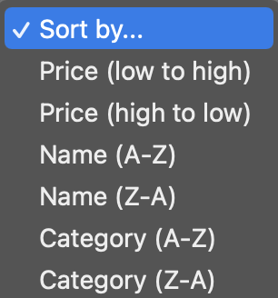
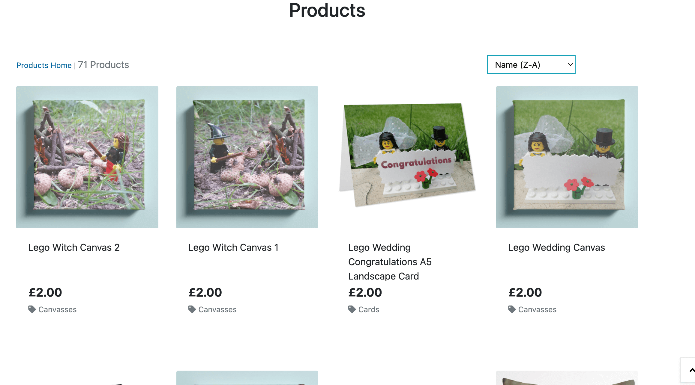
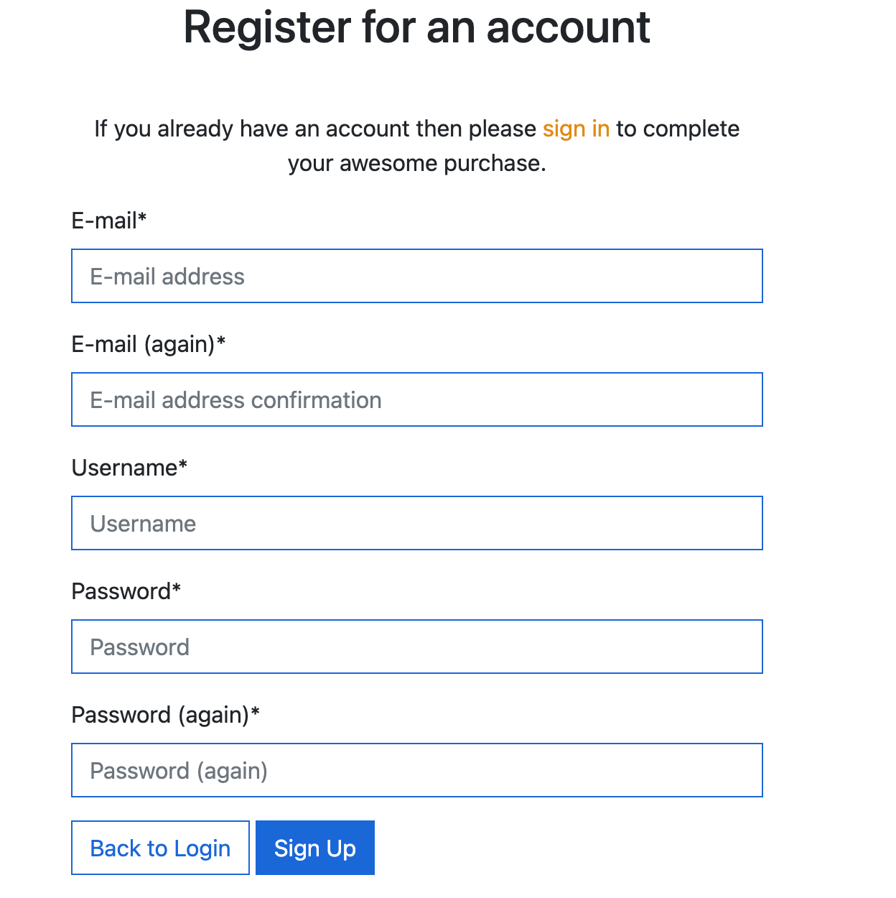
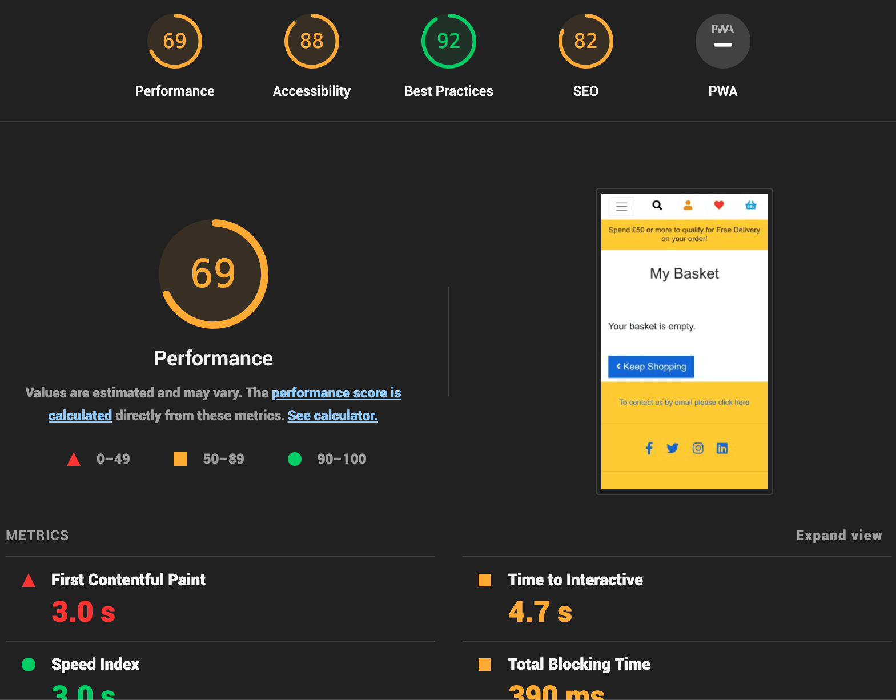
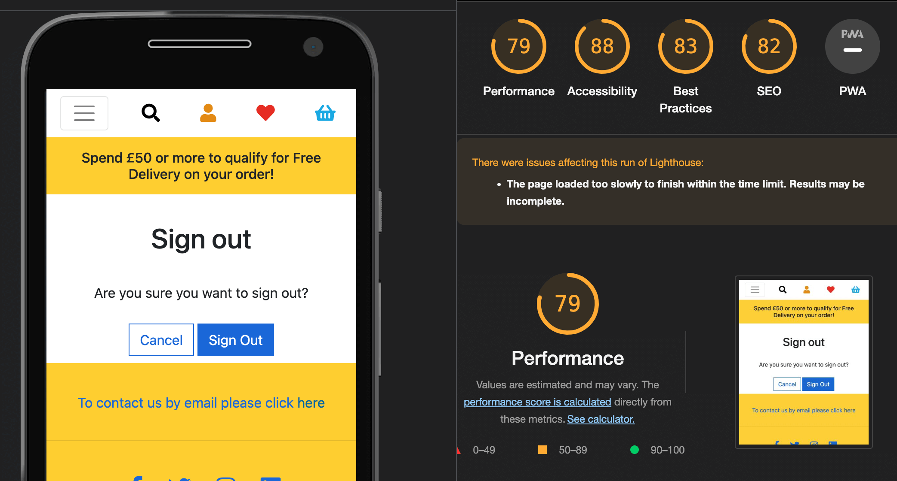
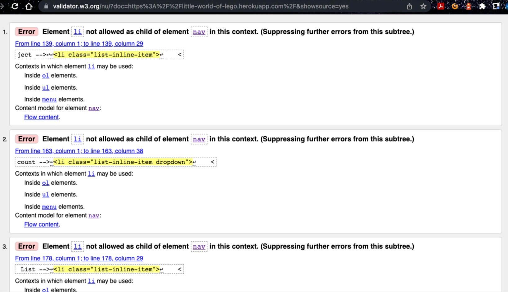
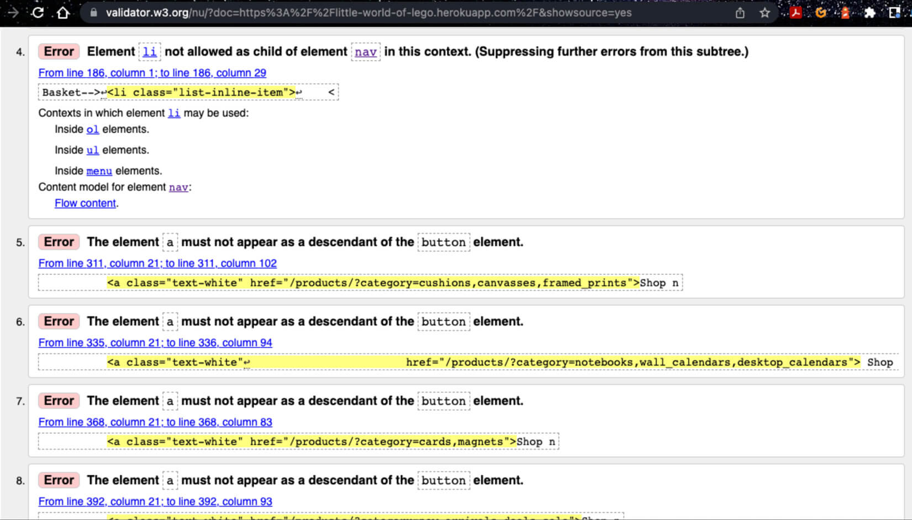
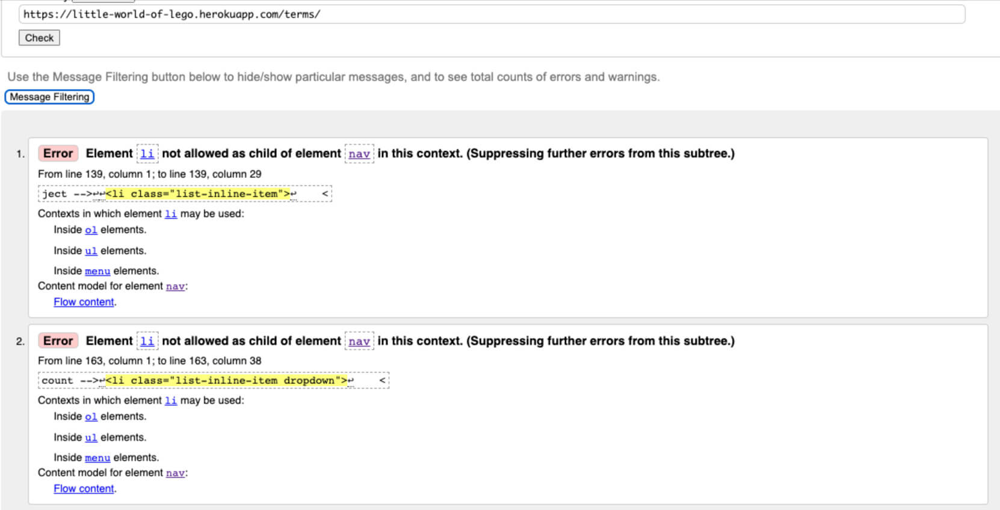

Back to [README.md](README.md) file

## Testing

## Table of Contents
1. [Home](#home)
2. [Navigation](#navigation)
3. [Products](#products)
    * [Product Details](#product-details)
    * [Add product](#add-product)
    * [Edit product](#edit-product)
    * [Delete product](#delete-product)
5. [Register page](#register)
6. [Log In](#log-in)
7. [Profile](#profile)
8. [Wish List](#wish-list)
9. [Basket](#basket)
    * [Update Quantity](#update-quantity)
    * [Remove product from basket](#remove-from-basket)
10. [Checkout](#checkout)    
11. [Testing User Stories](#testing-user-stories)
12. [Implementation](#implementation)
13. [Devices used](#devices-used)
14. [Browsers](#browsers)
15. [Lighthouse Results](#lighthouse-results)
16. [Validators](#validators)
	* [HTML Validator](#html-validator)
	* [Jigsaw CSS Validator](#jigsaw-css-validator)
	* [JSHint](#jshint)
	* [JSONFormatter](#jsonformatter)
	* [PEP8](#pep8)

## Testing:
### Home
* Tested the Shop now buttons link to the right categories.
* Tested the back to top shows on the home page and scrolls smoothly to the top.
* Tested the link to the home page works by clicking on the logo.
* Tested contact email in the footer works and opens up the Mail app on my Mac.
* Tested all social Media links open and point to the correct Social Media pages, groups etc.
* Tested the Terms and Conditions opens up the Terms and Conditions page

### Navigation
* Tested links dropdown as expected
* Tested all links in the nav bar go to the categories that was clicked.
* Tested the profile icon in the nav bar dropdown works.
* Tested the links in the profile dropdown work and go to the right pages.
* Tested the basket takes me to the basket page
* Tested the search function and that this returns the result if the product exists, or a result that a product wasn’t found.

### Products
* Tested that when the link is clicked the page is navigated to.
* Tested that products clicked take me to the product detail of the product that was clicked.
* Tested products images expand for a larger view of the product.
* Tested products can be added to basket on the product page.
* Tested in the admin view products can be edited and the link takes me to the page to edit this product.
* Tested in the admin the delete button works and the product is deleted.

### Product Details
* Tested that when the link is clicked the page is navigated to.
* Tested that product details are shown on all devices clearly.
* Tested that the product image can be clicked and viewed in another browser tab as a larger clearer view.

### Add product
* Tested that when the link is clicked the page is navigated to.
* Tested that a product can be added from the admin panel.
* Tested that when a product has been added without an image that the Photo coming soon image is displayed.
* Tested that required fields are called for if these have been left blank.
* Tested that the form works for the details that are input and no errors exist.
* Tested that an image can be uploaded when adding a product.

### Edit product
* Tested that when the link is clicked the page is navigated to.
* Tested that product text fields can be amended and updated.
* Tested that an image can be changed.
* Tested that a product image can be removed and the Photo coming soon displays.

### Delete product
* Testing that when the delete button has been pressed on the product intended for deletion the link works.
* Testing the product has been deleted by searching for this in the search function in the nav bar. 
* Testing the product has been deleted by looking in the category that the product was in.

### Register page
* Tested that when the link is clicked the page is navigated to.
* Tested that a user can register for an account.
* Tested that when a user has entered their details for an account that this sends an email asking the user to verify their email address.
* Tested the login link works and this is displayed to the user.

### Log In
* Tested that when the link is clicked the page is navigated to.
* Tested the fields that are required call for values to be entered.
* Testing that values can be entered into the fields.
* Testing the buttons on the login page work as intended.
* Tested the forgotten password button returns the forgotten password page, which allows me to go through the process of being able to recover my account.
* Tested the wrong details input to a registered user is secure and will not log me in and notify me that something is wrong.
* Tested to see if a non registered user can not login.
* Tested the create account link works and this is displayed to the user.

### Profile
* Tested that when the link is clicked the page is navigated to.
* Tested to see the users orders in their profile.
* Tested to see the order number link works and shows the users order details and displays a message that this is an old order and the details were emailed to the user.
* Tested to see if the user can update their details and save them to their profile.

### Wish List
* Tested that when the link is clicked the page is navigated to.

### Basket
* Tested that when the link is clicked the page is navigated to.
* Tested to see if items can be added to the basket.
* Tested the minus button doesn’t allow a negative number to be put in to the quantity field.
* Tested the plus button doesn’t allow more than 99 items of the same product can be put in, but no more than 99 in to the quantity field.
* Tested the keep shopping button to see if the redirect works.
* Tested the secure checkout button works as intended and takes the user to the secure checkout page.

### Update Quantity
* Tested the update button under the quantity box to see if the product amount updates.
* Tested to see the updated product shows the new subtotal and grand total, as well as the free delivery threshold kicking in should the product total be below £50.

### Remove product from basket
* Tested the remove button under the quantity box to see if the product is removed from the basket.
* Tested to see that the removed products have been removed and the grand total updates, as well as the free delivery threshold kicking in should the product total be below £50.

### Checkout
* Tested that when the link is clicked the page is navigated to.
* Tested the fields to ensure that the required details are asked for if left blank.
* Tested the Country dropdown allows the user to select the country, and this shows to the user as expected.
* Tested to see if the wrong details in the card box returns an error notifying the user that their card details are not correct.
* Tested the card details field to ensure that the card logo is displayed if the card is valid.
* Tested the adjust basket button works and takes me to the basket as intended.
* Tested that upon complete order button works as intended.
* Tested upon complete order button is clicked the user is shown a processing overlay on the page, this is so they are aware an action has happened.
* Tested that once the processing overlay has vanished the user is taken to their profile to see their order.

## Testing User Stories
The following user stories were tested to ensure that they deliver the users expectations and what the user wants.
1. Browse the site and get a good understanding of what this has to offer me as a user/customer.
* As a user I can clearly see that this site is all about purchasing Lego themed products. I land on the home page and can see the different categories in the nav bar, as well as a glimpse of the product images that are in those categories clearly laid out as I scroll down the home page. 

2. Navigate from home page to specific product categories using the Shop Now buttons or the nav bar with the drop down links.
* I am easily able to navigate from the home page to specific product pages from the home page by either using the Shop Now buttons by the different categories on the home page, or by using the links in the nav bar to see the product(s) in the various categories.

3. See product images and prices, then click into products to see images, descriptions and price clearly laid out.
* I am able to see the product images and prices on the page of items available in the categories. I am able to click on a product and be redirected to a page with the product image, name, description and price all clearly laid out. I am also able to click the image of a product and see a larger and clearer image of the product that I would like to potentially purchase.

4. Find items using links provided.
* As a user I am able to find items by clicking on the links that have been provided either on the nav bar, search bar and/or use the Shop Now buttons on the home page. With all of these features I can easily find the items or categories that the items are likely to be in. 

5. Sort products by price lowest to highest and highest to lowest.
* When I go into the product categories I am able to sort products from highest to lowest price, as well as lowest to highest price. Having this feature allows me to have a clear choice of higher priced items, or if my budget was tight shop for and purchase the lower priced items that are on sale. Users are also able to get the items by price when selecting the All Products dropdown from the nav bar and clicking the By Price link.

6. Sort products by name A-Z or Z-A. 
* I am able to sort products from A - Z and Z - A. This allows me to search for a product quicker and easier, without having to scroll too much through all products. This means that I can get where I would like to and purchase items quicker.

7. Sort products by category A-Z or Z-A. 
* I am able to sort categories from A - Z and Z - A. This allows me to search categories quicker and easier, without having to scroll too much through all categories on the all categories menu. This means that I can get where I would like to and purchase items quicker. Users are also able to get the items by category when selecting the All Products dropdown from the nav bar and clicking the By Category link.

8. Search for items.
* I am able to search for an item by using the search function at the top of my page. If the item is found this will be displayed to the user. If the item is not in the database the user will be shown that there are no items for this search. If a user presses the search icon without entering any criteria to search for the user is notified that they didn’t enter anything to search for. The user is also redirected to the all products page.

9. Add products to my basket ready for checkout.
* I can add products to my basket easily by clicking on the product, going into the product detail and then adding this to the basket. I am notified that my product has been successfully added to my basket and is ready to be updated, removed or even purchased via the checkout.

10. See the total price displayed under the basket icon as well as a notification that if I spend x amount more I can get free next day delivery.
* When an item is added to my basket this shows the price under the basket icon, but not only this the total is shown in the notification under the basket. This also shows me that u need to spend x amount more in order to get free delivery. As a user I can either continue with the purchase and pay the delivery cost, or add the extra required if I would like to get free delivery on my order.

11. See the cost of items in my basket excluding the delivery costs.
* I am able to see in the dropdown underneath my basket the cost of the items added and if there is a delivery charge this says exc delivery. If the free delivery threshold is reached then this isn’t shown as it isn’t required.

12. Go into my basket and update the quantity of the product(s) that I have added or even remove products from my basket.
* I am able to go to my basket and update the quantity of the products that I have in my basket or even remove them.

13. Upon updating products or removing products see the price change for product subtotal, delivery charge and also grand total updated.
* I am able to see upon updating the quantities of products or removing products the subtotals of these products at the side (if quantity has been updated) or if an item has been updated and one removed the grand total updated. I can also see the free delivery updated should I remove or update items to the cost below the free delivery threshold.

14. If I am a new user be able to register for an account and validate my email address to gain access to my new created account.
* As a new user I am able to register for an account and receive an email validation to gain access to my account.

15. If I am an existing user be able to log into my account so that I can complete my purchase.
* As an existing user I am able to log into my account to complete my purchase, although am able to check out as an anonymous user too. The added advantage/benifits that I get as a registered user is that if I loose the email confirmation, or have incorrectly typed in my email address I am able to see the order(s) in my profile. I can click on the order number and this alerts me that an email was sent to the email address entered on the date. I will then be able to (if I haven’t already when checking out) see that the email address that I entered was not correct and this was why I didn’t receive the original email confirmation of my order. 

16. Before completing my order and entering in my card details see the products and quantities of products in my basket and how much I will be charged before I enter my card details.
* Before entering in my card details I am able to see the product(s), quantities, subtotal/order total, delivery total, how much I would need to spend If I would like free delivery and the grand total of my order. This is located in the panel next to the form for me to input my details. Once all of my details and delivery details have been put in I can see before I enter in my card number that my card will be charged £xx.xx. This allows me as a user to be able to know and see clearly what I will be paying before I enter any information. This gives me the opportunity to be able to look at why I am being charged this by scrolling back up to the order panel in the checkout. I am able to see that I have either not enough of this product, just the right amount, or too many of this product or other products so can make a change before completing my purchase. This gives me the user full control over what I would like, the quantities of what I would like and the new updated totals showing how much I will pay. 

17. Complete my purchase by being able to enter my delivery details and credit card number.
* If I am a user that doesn’t have an account I am able to enter my delivery details and credit card number into the form on the checkout page and complete my purchase. The only thing being, that as an anonymous user I will have to enter all of my details every time when I want to purchase items. Whereas if I am a registered logged in user I only have to enter my name and credit card for every purchase made if I have allowed my details to be saved. This creates a better experience for me as the user. Also as a registered logged in user I am able to change these delivery details by updating them in my profile. As a registered or anonymous user I am able to enter in new delivery details if I would like this order sent to someone else at a different address, or if I would like this delivered to my work place, or even if I have moved house. Again the delivery details are not saved if I am not a registered/logged in user. I also have the ability to untick the save delivery details if this is just a one off change of address, or have orders delivered constantly to this address if I want to update/save my details. I can do this change from either my profile side of things, or in the checkout form page if I wish to change this there.

18. Be aware that the payment is processing through an icon or something showing on screen to indicate this.
* When I press the Secure Checkout button on the checkout page I am shown a transparent overlay with a spinning icon. This shows me that something is happening in the way of either accepting my payment or declining this processing transaction.

19. Once I have checked out and completed my order, be sent an email confirmation so that I have something to refer to should there be any issues.
* Upon checkout completion I am notified that the email that I used has been sent an order confirmation. When I check my mail box I see that I have received an email with my order number, date, total, delivery cost, grand total, delivery address and phone number. Also there is an email address that I am able to contact should there be any problems or questions that I may have regarding my order. I am also reminded that with my phone number on the account that I have provided will be used in case of delivery problems.

20. See my order history when I am logged in and go to my profile. This is so that I have something to refer to should I not receive the email confirmation, have accidentally deleted the email, or can’t find the email that was sent upon order completion.
* When I login I am able to go to my user profile, here I can see my past orders. I am able to click on the order number and see the order confirmation and the email that this was sent to. This is quite handy as I have lost the original email confirmation from when I placed the order that was sent at the time.

21. Update my details such as name, address, email and phone number in my profile.
* In my profile I am able to update my phone number and address. I am able to put in my email address and name in the checkout page and have this saved to my profile.

22. Add and remove items to and from my wish list.
* I am able to add items to my wish list as well as remove items from my wish list. There is a button provided in the wish list that allows me to be able to remove items from my wish list in my wish list. To add an item to my wish list I do this from the product detail view.

23. Add items to my basket from my wish list.
* I am able to add products that are in my wish list to my basket which will enable me to complete my order. There is a button that has been provided that allows me to do this.

24. Be able to log into my account, and if I forget my password be able to easily reset this so that I can access my account again.
* If I forget my password I am easily able to reset this. If I go to the Login page I will see that there is an orange border button that says Forgot Password? If I hover over this button it changes from an orange border to an orange box. If I click this button I am redirected to the page that says Password Reset. I am able to put my email address into the box and click the Reset my password button. I will receive an email with a link that will enable me to reset my password and regain entry to my account.

#### Admin Only
1. Update product descriptions for items that I have for sale.
* The site owner is able to easily log in, go to the product that they wish to update, press the Edit link and go ahead and update product descriptions, images, prices, item names, sku and even place items into the right category. On pressing the Edit link the store owner is notified that they are editing this product. Site owners are also able to remove an image that is associated with a product and replace this with a different image. When a store owner sets the image there is a notification telling them which image they have selected underneath the select image button. 

2. Add new products so that I can extend the range that the store has to offer my customers.
* When logged in as the store owner they can click the My Account dropdown in the main nav bar then go to Product Management, select this and be taken to the Product management page. Here the store owner is able to add the product name, sku, select the right category, add a description, image and price. They can submit this by pressing the submit button and this new item will then be live on the site.

3. Delete products that are no longer in stock.
* The site owner is able to easily log in, go to the product that they wish to delete and press the delete link. This will delete the item from the database and off of the live site.

## Implementation
This is my fourth and final Milestone Project that I have completed with the Code Institute. In the Boutique Ado mini project I came across some errors and how to fix them, this has helped me to keep an eye out so that these errors are not repeated. The more I use the languages the more I am learning, as well as finding errors be it in code or that cause bugs to break the code that is there, but this is all part of the learning that is helping and setting me up for future roles in this career field.

## Devices Used
The following devices were used to test this site on:
* iPhone 13
* 13 inch MacBook Pro
* iPad (5th generation)

## Browsers
The following Browsers were used to test this site on:
* Google Chrome
* Safari

## Lighthouse Results
### Home Lighthouse results

### Products Page Lighthouse results

* I'm dissapointed by the score of this page on a mobile device, but have tested it on mobile for speed and I think it does very well. I will try to see if I can improve on the score for mobile and raise this to at least between 50%.

### Product Details Lighthouse results

### Basket Lighthouse results

### Checkout Lighthouse results

### Checkout Success Lighthouse results

### Profile Lighthouse results

### Add a product Lighthouse results

### Terms and Conditions Lighthouse results

### Sign out Lighthouse results

### Sign in Lighthouse results

### Register Lighthouse results

## Validators
### HTML Validator
I ran the HTML of my site through the [W3 HTML Validator](https://validator.w3.org/) and this returned the following results:

### Home HTML Validation

### Profile HTML Validation

### Terms and Conditions HTML Validation

### Other pages
The following pages all had the same HTML errors / warnings as the Home page.
* Products Page HTML Validation
* Product Details HTML Validation
* Basket HTML Validation
* Checkout HTML Validation
* Checkout Success HTML Validation
* Wish List HTML Validation
* Add a product HTML Validation
* Edit a product HTML Validation

### Nav bar
I had a look at the trying to fix the list li errors. To do this I added a ul as a start and end of the nav links, but this added a bullet point to the nav as shown in the image below. I decided that the list li errors would have to be left as they were so not to cause any errors or problems.

### Jigsaw CSS Validator
I ran the CSS of my site through the [W3 CSS Validator](https://jigsaw.w3.org/css-validator/) and this returned the following results:

### Products CSS Validation

### Basket CSS Validation

### Checkout CSS Validation

### Profile CSS Validation

### Base CSS Validation

### JSHint
I ran the JavaScript that is being used in my site through the [JSHint](https://jshint.com/) and this returned the following results:

### Stripe Elements JS Validation

* I have left the missing semicolon as I was getting a console error. I'm not sure why there are the other two warningsa about the 'template literal' but these have been left.

### Quantity input JS Validation

* The other warnings have been left as I believe that this is because of the nature of the file, being in an html document, rather than its own JS file.

### Country Field JS Validation

* I have removed the unnecessary semicolon, so this is now ok as per the JSHint validator. I have ignored the let warning that is there.

### JSONFormatter
I ran the JSON of my site through the [JSONFormatter](https://jsonformatter.org) site and this returned the following results:

### Categories JSON Validation

### Products JSON Validation

### PEP8
I ran the Python of my site through the [PEP8](http://pep8online.com/) site and this returned the following results:
